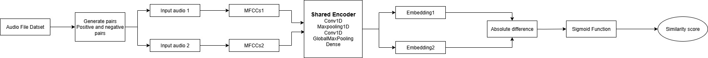

# AudioListenMet - Urdu Alphabet Matching

A deep learning-based audio recognition system that identifies Urdu alphabet characters from spoken audio using a **Siamese neural network architecture**.

---

## 📌 Overview
This project implements a Siamese neural network to recognize and match Urdu alphabet characters from audio input.  
The system can either **record new audio** or **process uploaded audio files**, then compare them against a pre-trained dataset of Urdu alphabet pronunciations.

---

## 🧠 Model Architecture
The system uses a **Siamese neural network** with the following architecture:

- **Conv1D Layer** (64 filters, kernel size 5, ReLU activation)  
- **MaxPooling1D** (pool size 2)  
- **Conv1D Layer** (128 filters, kernel size 5, ReLU activation)  
- **Global Average Pooling**  
- **Dense Layer** (128 units, ReLU activation)  

### 🔗 Similarity Calculation
- Compute absolute difference (L1 distance) between the two audio embeddings using a custom **AbsDifference** layer.  
- Pass the difference through a Dense layer with **sigmoid activation** to output a similarity score:  
  - `0 → Different audio`  
  - `1 → Same audio`

---

## System Architecture


## 📊 Dataset
- Trained on a **custom dataset of Urdu alphabet pronunciations** (`urdualphabets11`).  
- Contains multiple recordings for each Urdu alphabet character.  
- Includes variations across different speakers and pronunciations.  

---

## ⚙️ Installation
Clone the repo and install dependencies:
```bash
git clone https://github.com/username/AudioListenMet.git
cd AudioListenMet
pip install -r requirements.txt

```

🚀 Usage

Run the main script:
```bash
python predictiion.py
```

## Choose an option:

1. Record new audio (2-second recording)
2. Upload an existing audio file

## The system will:

1. Record/upload audio
2. Remove background noise
3. Extract MFCC features
4. Compare with stored Urdu alphabet recordings
5. Return the best match with similarity score

---

## 🎯 Training Process

1. The model was trained using a Siamese network approach with:
2. Positive pairs: Different recordings of the same Urdu character
3. Negative pairs: Recordings of different Urdu characters
4. Data augmentation: Noise addition, pitch shifting, time stretching
5. Optimizer: Adam (lr = 1e-4)
6. Loss function: Binary cross-entropy

## 📈 Achieved 96% validation accuracy after 15 epochs.

## ✅ Results

The system can effectively:

1. Recognize Urdu alphabet characters from spoken audio

2. Handle pronunciation & recording quality variations

3. Provide similarity scores for confidence in matches

## Example output:

🔍 Best Match: bay (Score: 0.9132)

---

🔮 Future Improvements

1. Expand dataset with more speakers and variations

2. Implement real-time continuous speech recognition

3. Add support for Urdu word and phrase recognition

4. Develop a user-friendly GUI interface

---

🙏 Acknowledgments

This project was developed as part of audio recognition research, specifically focused on Urdu language processing using deep learning techniques.

